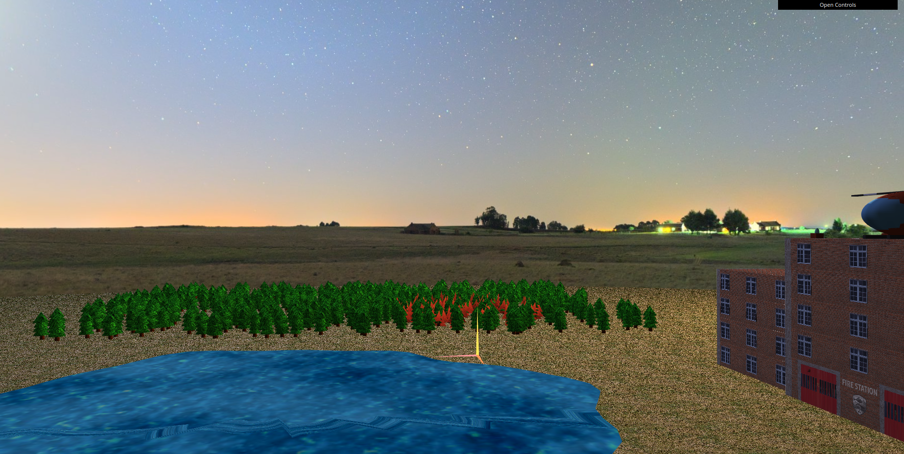
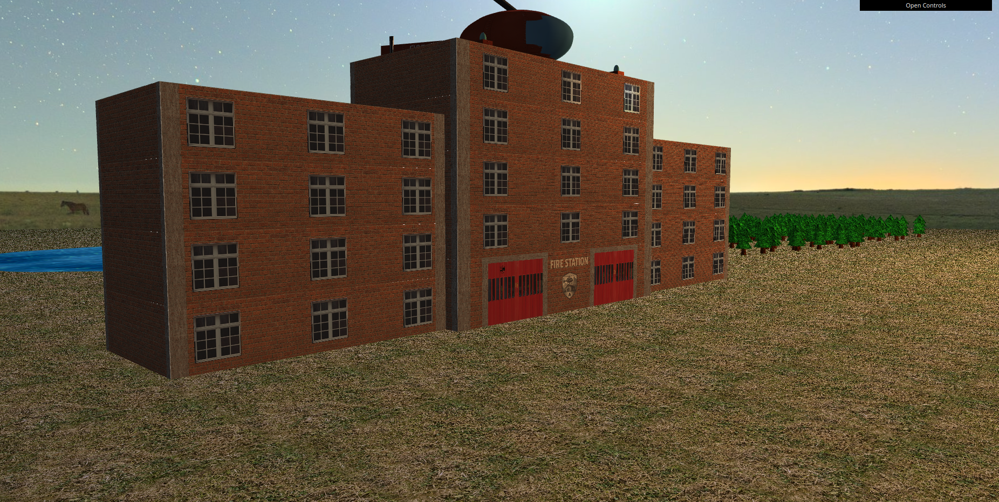
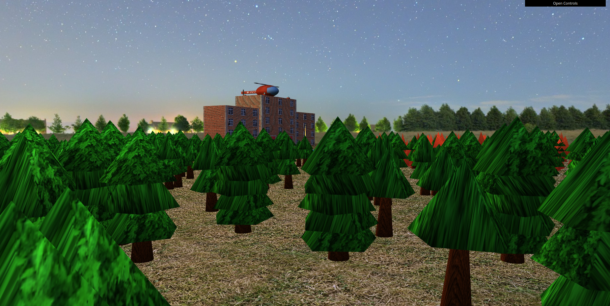
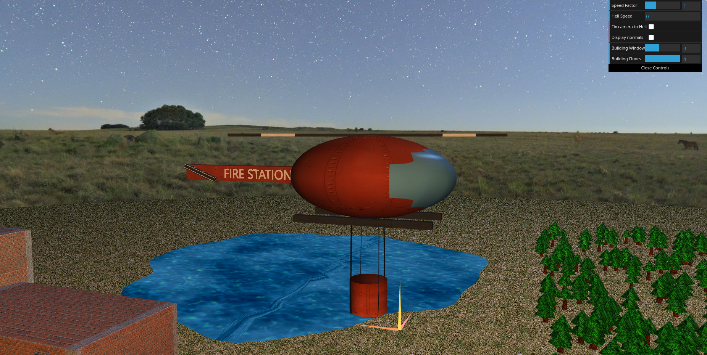
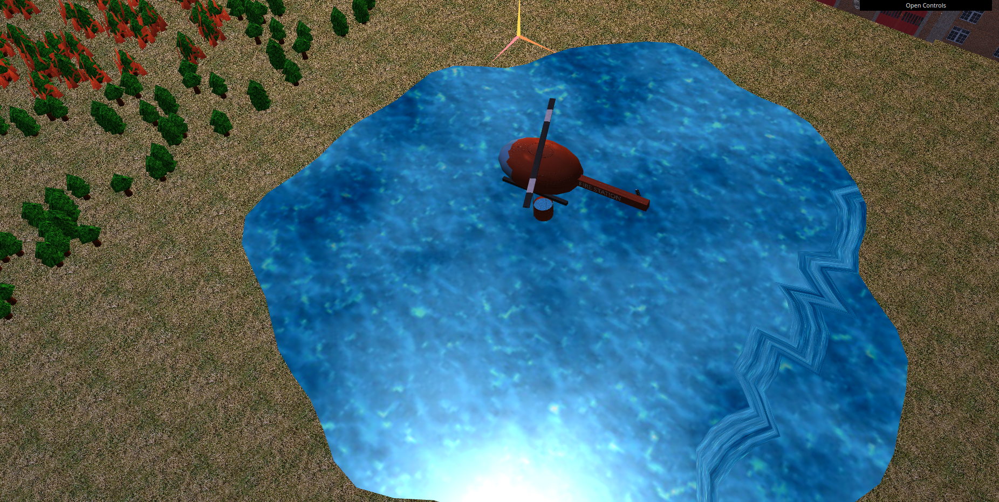
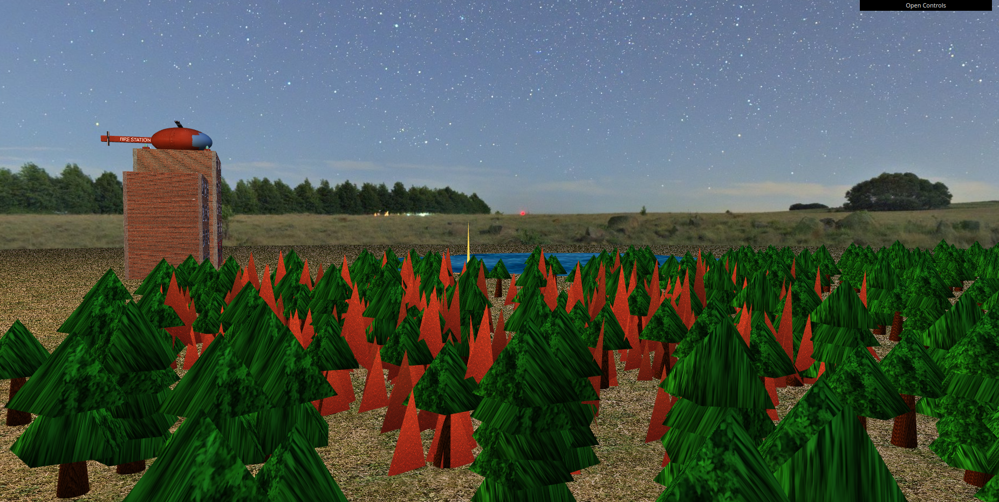

# CG 2024/2025

## Group T06G04

| Name             | Number    | E-Mail             |
| ---------------- | --------- | ------------------ |
| Afonso Castro         | 202208026 | up202208026@up.pt                |
| Tommaso Cambursano         | 202411502 | up202411502@up.pt                |


## Project Notes

- We began this project by setting up the provided code with an initial plane, a light source, and the coordinate system axes. We also created a ```MySphere``` class using the required constructor details, which would later help us represent an Earth once an Earth texture was applied to its exterior.

- A new object, ```MyPanorama```, was created using the previously defined MySphere class. This time, a skybox texture was applied to the interior of the sphere, creating the landscape of our new world.



- We created the ```MyBuilding``` object to represent the fire station, which serves as the spawn point for our firefighting helicopter (in the existing helipad on top of the central module).

- The object was implemented according to the specified constructor requirements, allowing customization of the number of floors and windows, and we created our custom textures for the entrances, the walls, and the helipad.



- To create the forest, we first developed the ```MyLeaf``` class. This class displays a prism with a customizable number of lateral faces.

- Using ```MyLeaf``` for both the leaves and the trunk, we created the tree (```MyTree```) class, which takes parameters such as the number of leaves, height, tilt, and radius. Texture and color are also passed as input.

- Finally, the ```MyForest``` class is used to manage all the randomness in the forest. It creates an array containing the positions of all trees and initializes ```MyTree``` instances with random values. The forest dimensions (in the x and z directions) and the number of trees are provided as input.



- For our protagonist, the helicopter, we created the ```MyHeli``` class, where most of the code related to the helicopter's appearance and actions will be.

- The Helicopter was built using modified ```MySphere```, ```MyUnitCubeQuad```, ```MyCylinder``` class objects. The ```MyBucket``` was the only object of the helicopter created entirely from scratch.

- We created custom textures for the helicopter to give it more character and a small touch of realism.



- After creating all the visual components of the helicopter, we focused on bringing it to life. We implemented its movement, turning, acceleration, spinning propellers, altitude transitions, bucket states (full and empty), tilting at certain speeds, etc.

- In essence, we set up all the interactions between the helicopter and the world being built around it.


- The lake is created as a circle with some randomness at the edges to let it appear more natural.

- Multiple concentric circles create the net of the lake which is then animated with ```water.frag``` and ```water.vert```.

- We wanted to represent the fire as red triangles moving near the trees.

- To achieve this, a ```MyFlame``` object was created to represent a single triangle. This object is then used within the ```MyFire``` class.

- ```MyFire``` retrieves data from the scene about the forest in order to correctly display the flames—specifically the positions and sizes of the trees from the treePosition array.

- When initializing the fire, a random point within the forest area is selected along with a radius; this defines the area where the fire will appear.

- In the display method, a for loop checks each tree to determine whether it is inside the fire area. If it is, flame objects (```MyFlame```) are displayed around that tree.



- To give the fire some movement, we used shaders—both to change the color intensity and to animate the position of the flames.

- In ```flame.frag```, the base color of each flame pixel is modified using sine and cosine functions, creating a smooth light flickering effect over time.

- In ```flame.vert```, similar sine and cosine functions are used to alter the triangle positions, giving the flames dynamic motion.

- To make the fire appear more natural, randomness is introduced through a ```flameRandom``` float, which is initialized in ```flame.vert```.

- The general behavior of the fire can be controlled by adjusting ```flickerSpeed``` (which affects the light flickering) and ```oscillation[X|Y|Z]``` (which affects the movement).




- For the ```Additional Developments```, we chose to implement Option ```B``` (H/UP/DOWN Transition Blending). We improved the previously implemented transitions between the helipad's "H" texture and the UP and DOWN textures (used during takeoff and landing, respectively) to make them smoother. This was achieved by mixing the textures in the transitions using shaders.


